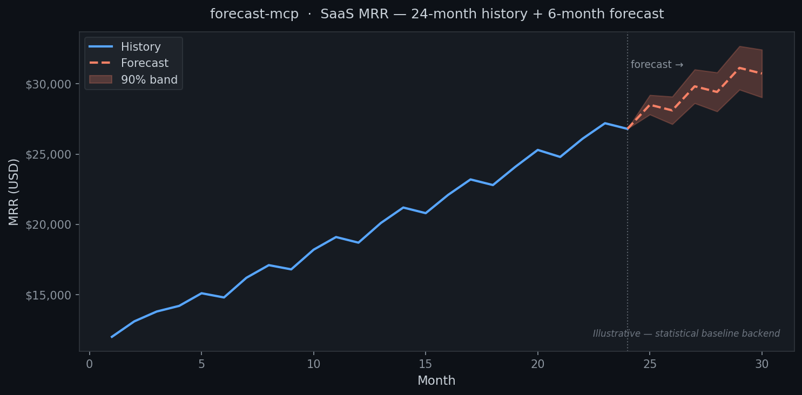

# forecast-mcp

**Give any AI agent time-series forecasting superpowers.**

`forecast-mcp` is an [MCP](https://modelcontextprotocol.io) server that lets Claude Code, Claude Desktop, Cursor, or any MCP-compatible agent forecast a series of numbers — sales, traffic, usage, costs — and reason about the result.



## Why

LLM agents can read, write, and run code — but they can't see the future. This gives them a clean `forecast` tool. The agent calls it, gets point forecasts + uncertainty bands + a compact trend/seasonality summary, and writes the explanation and recommendation itself.

## What you get

| Tool | What it does |
|------|--------------|
| `forecast` | Forecast a single series with optional uncertainty bands |
| `list_backends` | Report which engine is active (timesfm / baseline) |
| `backtest` | Hold out the last N points and compare TimesFM vs baseline (MAE/sMAPE) |

## Two backends, zero configuration

| Backend | When active | What it needs |
|---------|------------|---------------|
| Statistical baseline | Always | Just `numpy` — already a dependency |
| TimesFM 2.5 (Google) | When installed | `pip install "forecast-mcp[timesfm]"` |

The server auto-detects TimesFM and uses it; otherwise it falls back to the baseline. Either way, `forecast` always returns something useful.

## Quickstart (30 seconds)

```bash
uvx forecast-mcp
```

Add to your agent config:

```json
{
  "mcpServers": {
    "forecast": { "command": "uvx", "args": ["forecast-mcp"] }
  }
}
```

Then ask your agent: *"Forecast the next 6 months from this revenue data and tell me what to expect."*

[Get started →](getting-started.md){ .md-button .md-button--primary }
[See client configs →](client-setup.md){ .md-button }
